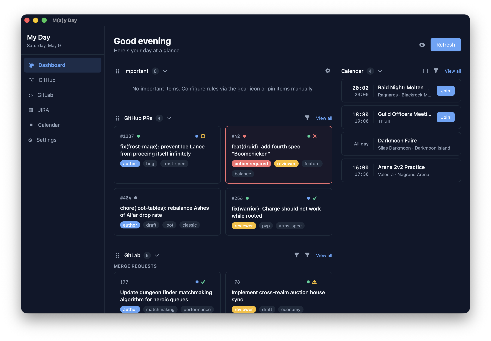

# MayDay

A developer dashboard that brings your daily work into one view -- pull requests, merge requests, tickets, pipelines, and calendar events, all in a single Tauri desktop app.



### Features

- **GitHub** -- open PRs across your repos, with review status, CI checks, and action-required indicators
- **GitLab** -- merge requests and pipeline status at a glance
- **Jira** -- tickets assigned to you, grouped by status and sprint
- **Calendar** -- today's meetings from Microsoft 365 (Graph API / EWS) or any ICS feed
- **Dashboard** -- a unified view with drag-and-drop section ordering, filters, and pinned items
- **Auto-updates** -- checks for new versions on launch, with manual check in Settings

## Prerequisites

- [Rust](https://rustup.rs/)
- [Node.js](https://nodejs.org/) 22+
- [pnpm](https://pnpm.io/) 9+

## Dev

```bash
pnpm install

# start everything (vite + server + tauri window)
pnpm dev:desktop

# or web-only in the browser (no tauri window)
cargo run          # rust server on :3001
pnpm dev:web       # vite frontend on :5173
```

In dev mode, Tauri loads the frontend from Vite's dev server (`:5173`) with hot reload.
The desktop app uses Tauri IPC commands instead of the HTTP server -- the `myday-server` crate
is used as a library for its service layer, not as a running web server.

(i) Note: the server mode using axum is mostly due to the original plan being having a seperate server
deployment and a slim frontend only. However due to how EWS integration etc. works, this project is now
fully focussed on the tauri app using commands and the axum layer only kept around as 'legacy'.

## Build

```bash
pnpm install
pnpm --filter @myday/desktop build
```

The `.dmg` will be in `apps/desktop/src-tauri/target/release/bundle/dmg/`.

## CI/CD

- **CI** (`ci.yml`) -- runs on PRs and pushes to `main`. Checks Rust compilation and builds the desktop app without bundling.
- **Release** (`release.yml`) -- manual trigger via `workflow_dispatch`. Builds signed and notarized `.dmg` files for both `aarch64` and `x86_64`, uploads artifacts, and optionally creates a draft GitHub Release when a version tag is provided.

### Required secrets for release builds

| Secret | Description |
|--------|-------------|
| `APPLE_CERTIFICATE` | Base64-encoded `.p12` of the Developer ID Application cert |
| `APPLE_CERTIFICATE_PASSWORD` | Password for the `.p12` export |
| `APPLE_SIGNING_IDENTITY` | Certificate SHA-1 hash or name |
| `APPLE_API_KEY` | App Store Connect API key ID |
| `APPLE_API_ISSUER` | App Store Connect issuer ID |
| `APPLE_API_KEY_CONTENT` | Contents of the `.p8` API key file |
| `TAURI_SIGNING_PRIVATE_KEY` | Private key for signing updater artifacts (see `~/.tauri/myday.key`) |

## License

Apache-2.0 -- see [LICENSE](LICENSE) for details.

Copyright 2026 Elena Gantner
